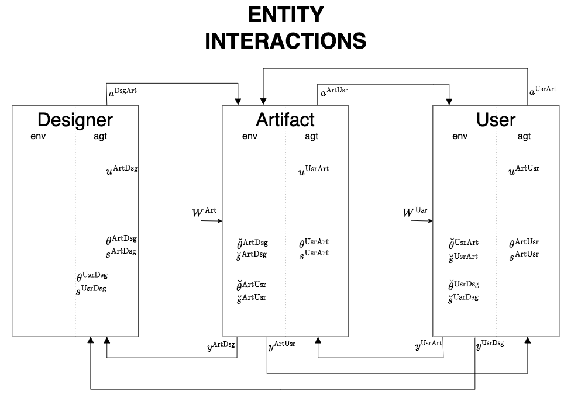
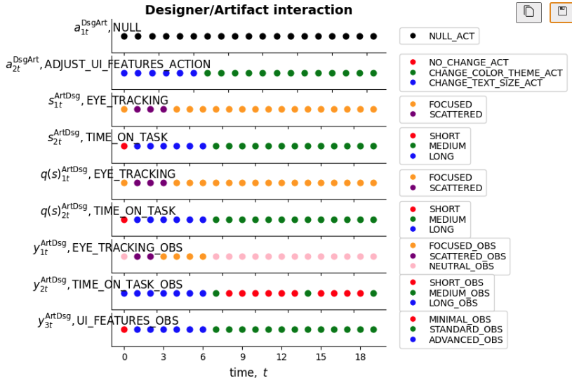

# **Designer-Artifact-User package**
Multi-agent active inference with PyMDP

This guide gives an overview of the the **Designer-Artifact-User** Python package. It also provides step-by-step instructions to install and set up the package on an Ubuntu 24.04 Linux system. For other operating systems, it should be easy to modify the appropriate commands.

---
# 1. Purpose of `dau-active-inference` Python package

The purpose of the `dau-active-inference` package is to allow a user to run an active inference based simulation for three interacting agents: a *Designer*, an *Artifact*, and a *User*. The Designer is attempting to steer the Artifact, the Artifact is trying to steer the User, and the User is trying to steer the Artifact. The overall operation of the agents is based on the active inference principle and is represented in the following diagram:



After running a simulation, the outcome of the experiment can be visualized as follows, for example, in the case of the Designer/Artifact interaction:



There is much more information available inside the accompanying notebook `Designer-Artifact-User.ipynb`:

https://github.com/LearnableLoopAI/Designer-Artifact-User/blob/main/Designer-Artifact-User.ipynb

There are also more `active inference` related projects at: 

- https://learnableloopai.com/blog.html
- https://learnableloopai.com/project.html

# 2. Most important `dau-active-inference` package dependencies

The `dau-active-inference` package primarily makes use of the `pymdp` and `inferactively-pymdp` packages for its operation. More information on these packages can be obtained from:

- https://pymdp-rtd.readthedocs.io/en/latest/
- https://github.com/infer-actively/pymdp

Here is a rough dependency structure:

- dau-active-inference
   - numpy
   - matplotlib
   - pandas
   - inferactively-pymdp
   - pymdp
   - torch
   

# 3. Installation Instructions for the `dau-active-inference` package

Please note that the installation will need about 6 GB of disk space. The installation process may take up to 15-20 minutes to complete if you do not have any of the dependencies installed.

Follow these steps in sequence:

1. Install python tools and dependencies:
   ```bash
   sudo apt update && sudo apt install -y python3-pip python3-virtualenv git

2. Clone and change the directory to the Designer-Artifact-User directory:
   ```bash
   git clone https://github.com/LearnableLoopAI/Designer-Artifact-User && cd Designer-Artifact-User

3. Create python virtualenv (.venv) and activate it from inside the Designer-Artifact-User directory:
   ```bash
   virtualenv .venv && source .venv/bin/activate

4. Install the dau-active-inference package and its dependencies:
   ```bash
   pip install --no-cache-dir dau-active-inference

5. Run dau-active-inference package with --help flag to see switch options (currently there is only one option):
   ```bash
   dau-active-inference --help

# 4. How to run simulations with the package from PyPI

6. To reach the PyPI repository, go to: https://pypi.org/project/dau-active-inference/
   ```bash
   dau-active-inference --duration 20

#### `duration` argument

The `duration` argument specifies the number of time steps or iterations to perform. The default value of the duration argument is 20. For example, if you need a simulation run over 50 steps, provide:
   ```bash
   dau-active-inference --duration 50
   ```

Currently, provision is only made for this single argument. In the future, the system might be expanded so that more arguments could be supplied.

If you are more technically-minded and understand the basic operation of the pymdp package, you are welcome to modify the `dau_activate_inference.py` file and experiment locally.

# 5. How to run simulations with the notebook file Designer-Artifact-User.ipynb

If you are more technically-minded and understand the basic operation of the `pymdp` package, you are welcome to execute/modify the `Designer-Artifact-User.ipynb` notebook file. It is easy to do this using the `VSCode` editor. Try these steps:

- Launch `VSCode`
- Open the `Designer-Artifact-User` folder
- When prompted at the bottom, confirm that you want to open the project in a `Dev Container`
- `VSCode` will use the `.devcontainer` folder in the project to spin up a container
- Open the `Designer-Artifact-User.ipynb` notebook and start to experiment

# 6. Future Work

Currently, only a single argument has been externalized: the `duration`. It would make sense to externalize many of the other parameters too. Experimenters need not be limited by this. They can either modify the `dau-active-inference.py` file, or, as just described, the `dau-active-inference.ipynb`. Let us know if you have questions:

- kobus78@gmail.com
- stefester@gmail.com